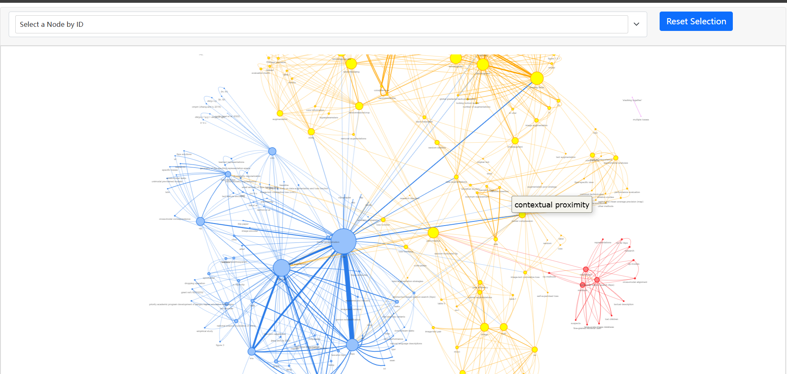
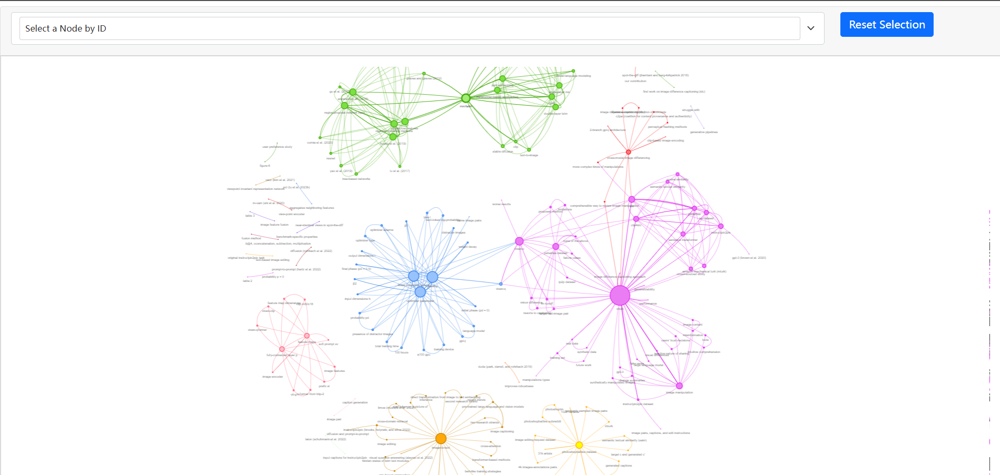
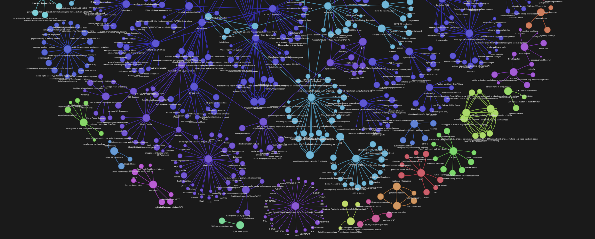

# MY WORK OF THIS PROJECT
## 爬虫

* 主要使用的技术：selenium，xpath，beautifulsoup
* AAAI   [dblp: AAAI 2024 (uni-trier.de)](https://dblp.uni-trier.de/db/conf/aaai/aaai2024.html)
* CVPR   [CVPR 2024 Open Access Repository (thecvf.com)](https://openaccess.thecvf.com/CVPR2024?day=all)
* ICML,KDD    (https://proceedings.mlr.press/)
* neurlPS     [NeurIPS 2023 Conference | OpenReview](https://openreview.net/group?id=NeurIPS.cc/2023/Conference#tab-accept-oral)
* 爬取了从 AAAI, ICML, NeuIPS, CVPR，KDD 平台各爬取有代表性的外文文本共计约800份（近两年），对应 5 种不同的文本风格，覆盖计算机视觉、机器学习、数据挖掘等多个主题.

## 数据处理

* 使用pdfminer对爬取的pdf转换为txt文本
* 用Re正则表达式对文本数据进行初步处理，主要删除最后的引用文献部分和文中的公式、数据以及表格
* 对inputdata中的文件进行编号，便于后续输出
* 对生成骨架的graph.csv处理，整合成三元组，便于进行图分类实验

## LLM

* 原作者使用了 [Mistral 7B Openorca](https://huggingface.co/Open-Orca/Mistral-7B-OpenOrca) ，我也在本地使用ollama部署了该模型，十分牛逼，感谢印度老哥指点。

* 

  

* chatgpt:在开始时使用了gpt-3.5的各种版本的api，包括gpt-3.5-turbo,gpt-3.5-turbo-0301,gpt-3.5-turbo-0613，也用了少量的gpt4和gpt4o的api，但国内平台均为第三方售卖，如[closeai](https://www.closeai-asia.com/)，但价格昂贵，1美金额度大约只能供两篇会议文章使用。

  且饱受接口限流影响，在高峰期相应时间相当慢，生成一次回答要四五十秒，甚至由于OpenAI侧负载过高遇到429错误，连续长时间无法使用，一个下午仅处理了一份文本！

* 感谢阿里云灵积模型平台，为新用户提供了多个模型免费额度，包括[Qwen-Turbo](https://help.aliyun.com/document_detail/2786271.html)，[Qwen-Plus](https://help.aliyun.com/document_detail/2786271.html)，等模型，生成迅速，十分好用。

使用在本地部署的[Mistral 7B Openorca](https://huggingface.co/Open-Orca/Mistral-7B-OpenOrca)生成的图谱唯一的缺点是速度较慢，处理一个文本约40分钟。

与chatgpt对比，上图为Mistral 7B Openorca，下图为chat-gpt-3.5-turbo的结果。

使用openai-api生成的文本图谱关系复杂，节点众多，但子图较少

使用qwen-api生成图谱节点简洁明了，关系错落有致，子图数量合理，美观大方

# Convert any Corpus of Text into a *Graph of Knowledge*           --Using LangChain &&LLM

*A knowledge graph generated using this code* 
ghpages link of this graph:https://github.com/Aliex-GC/Knowledge_Graph/blob/main/docs/graph.html

## What is a knowledge graph?
A knowledge graph, also known as a semantic network, represents a network of real-world entities—i.e. objects, events, situations, or concepts—and illustrates the relationship between them. This information is usually stored in a graph database and visualized as a graph structure, prompting the term knowledge “graph.”

## How to create a simple knowledge graph from a body of work?
1. Clean the text corpus (The body of work).
2. Extract concepts and entities from the body of work.
3. Extract relations between the entities. 
4. Convert a graph schema. 
5. Populate nodes (concepts) and edges (relations).
6. Visualise and Query. 

Step 6 is purely optional, but it has certain artistic gratification associated with it. Network graphs are beautiful objects (just look at the banner image above, isn't it beautiful?). Fortunately, there are a good number of Python libraries available for generating graph visualisations. 

## 
---

## This project
Here I have created a simple knowledge graph from a PDF document. The process I follow here is very similar to what is outlined in the above sections, with some simplifications.

First I split the entire text into chunks. Then I extract concepts mentioned within each chunk using an LLM. Note that I am not extracting entities using an NER model here. There is a difference between concepts and entities. For example 'Bangalore' is an entity, and 'Pleasant weather in Bangalore' is a concept. In my experience, concepts make more meaningful KG than entities.

I assume that the concepts that are mentioned in the vicinity of each other are related. So every edge in the KG is a text chunk in which the two connected concepts are mentioned.

Once the nodes (concepts) and the edges (text chunks) are calculated, It is easy to create a graph out of them using the libraries mentioned here.
All the components I used here are set up locally, so this project can be run very easily on a personal machine. I have adopted a no-GPT approach here to keep things economical. I am using the fantastic Mistral 7B openorca instruct, which crushes this use case wonderfully. The model can be set up locally using Ollama so generating the KG is basically free (No calls to GPT).

To generate a graph this the notebook you have to tweak. 

**[extract_graph.ipynb](https://github.com/Aliex-GC/Knowledge_Graph/blob/main/extract_graph.ipynb)**

The notebook implements the method outlined in the following flowchart. 

1. Split the corpus of text into chunks. Assign a chunk_id to each of these chunks.
2. For every text chunk extract concepts and their semantic relationships using an LLM. Let’s assign this relation a weightage of W1. There can be multiple relationships between the same pair of concepts. Every such relation is an edge between a pair of concepts.
3. Consider that the concepts that occur in the same text chunk are also related by their contextual proximity. Let’s assign this relation a weightage of W2. Note that the same pair of concepts may occur in multiple chunks.
4. Group similar pairs, sum their weights, and concatenate their relationships. So now we have only one edge between any distinct pair of concepts. The edge has a certain weight and a list of relations as its name.

Additional it also calculates the Degree of each node, and Communities of nodes, for sizing and coloring the nodes in the graph respectively. 

**[Here is a Medium article explaining the method in detail ](https://medium.com/towards-data-science/how-to-convert-any-text-into-a-graph-of-concepts-110844f22a1a)**

---
## Tech Stack

### Mistral 7B

I am using the [Mistral 7B Openorca](https://huggingface.co/Open-Orca/Mistral-7B-OpenOrca) for extracting concepts out of text chunks. It can follow the system prompt instructions very well. 

### Ollama

Ollama makes it easy to host any model locally. Mistral 7B OpenOrca version is already available with Ollama to use out of the box. 

To set up this project, you must install Ollama on your local machine. 

Step 1: Install Ollama https://ollama.ai

Step 2: run `ollama run zephyr` in your terminal. This will pull the zephyr model to your local machine and start the Ollama server.

### Pandas 
dataframes for graph schema (can use a graphdb at a later stage).

### NetworkX 
<a href="https://networkx.org"><a/>

This is a python library that makes dealing with graphs super easy

### Pyvis
[Pyvis python library](https://github.com/WestHealth/pyvis/tree/master) for visualisation. Pyvis generates Javascript Graph visualisations using python, so the final graphs can be hosted on the web. For example the [github link of this repo](https://rahulnyk.github.io/knowledge_graph/) is a graph generated by pyvis

